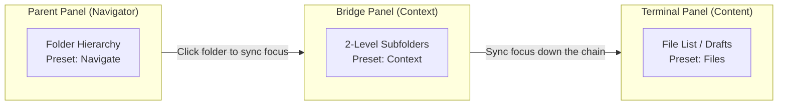

# Folder Spaces

[](https://github.com/edwardsayer/obsidian-folder-spaces/releases)
[](https://obsidian.md)
[](#compatibility--license)
[](LICENSE)

> **Turn any folder into an independent, dockable File Explorer space in Obsidian — so you can focus on one context at a time.**

---

Language: **English** | [繁體中文](README.zh-TW.md) | [简体中文](README.zh-CN.md)

Desktop only. Requires Obsidian **1.7.2+**.

---

## 📑 Table of Contents

- [Why Folder Spaces?](#why-folder-spaces)
- [Visual Showcase](#-visual-showcase)
- [Features](#features)
- [View Presets Reference](#view-presets-reference)
- [Cascading Panel Binding](#cascading-panel-binding)
- [Installation](#-installation)
- [Usage & Quick Reference](#usage--quick-reference)
- [Use Cases & Workflows](#use-cases--workflows)
- [Settings](#settings)
- [Developer API](#developer-api)
- [Compatibility & License](#compatibility--license)

---

## Why Folder Spaces?

Obsidian's default File Explorer shows your entire vault at once. As a vault grows into multiple projects, topics, and archives, the explorer becomes a crowded map where every folder competes for attention — even when you only care about one.

Folder Spaces lets you detach any folder into its own scoped explorer, so you see only the context you are working on:

- 🎯 **One context at a time** — Right-click any folder and open it as an independent file tree. Unrelated folders disappear from view, leaving only the project, topic, or task you care about. You keep the benefits of a single vault (links, search, and tags across everything) while working in a visually isolated space.
- 🪟 **Distraction-free windows** — Open a Folder Space in its own popout window to separate a task from the main workspace's sidebars and tabs. Work in a clean window without visual noise, and keep it on a second monitor if you like.
- 🔗 **Composable with Window Spaces** — Pair Folder Spaces with [Window Spaces](https://github.com/edwardsayer/obsidian-window-spaces) to save and restore these layouts. Together, they turn Obsidian into a **single-vault, multi-project, multi-theme workspace**: one vault, many independent focus windows, each arranged around its own folder context.

---

## 🖼️ Visual Showcase

### 🔗 Cascading Multi-Panel Chaining (Miller Column Navigation)
Chain parent and child Folder Spaces together in your workspace. Navigating folders in the parent panel automatically synchronizes bound child panels and opens notes in your active editor.


| 🎯 Single-Context Sidebar Focus | ⚙️ 7 View Presets & Flat Mode | 🔍 Header Controls & Live Filter |
| :---: | :---: | :---: |
|  |  |  |
| *Dedicated, scoped sidebar explorer with custom icon and zero vault clutter* | *7 tailored presets (Explorer, Navigate, Columns, Context, Contents, Files, List) + Tree/Flat modes* | *Compact single-row header with in-place live filter and instant query matching* |

---

## Features

### Open anywhere
- **Folder context-menu integration**: right-click any folder and open a Folder Space from the `Folder Spaces` submenu:
  - Open in default location
  - Open in left sidebar
  - Open in right sidebar
  - Open in editor area
  - Open in new window
- **Quick open**: use the ribbon icon or the `Open Folder Space` command to search for a folder and open it in the default location.
- **Open from inside a popout**: run the command or context-menu from within a popout window and the new Folder Space opens in that **same** popout — reusing or creating a full-height left/right sidebar pane, or opening in the popout's editor area — instead of jumping back to the main window.
- **Search in the same window**: when a Folder Space lives in a popout, the native *Search in folder* action shows its results in that same popout window.
- **Sidebar views in popouts**: open any native sidebar view — Tags, Outline, Backlinks, Outgoing links, Properties, Search, and more — in a popout window, draggable between splits and tab groups.

### Scoped, independent trees
- **Independent scoped views**: dedicated folder-scoped explorer views that never alter Obsidian's built-in full-vault File Explorer.
- **Tree & Flat view modes**: toggle between a nested tree and a clean flat list per folder.
- **Depth control**: expand to 1 level, 2 levels, or all levels — per folder.
- **Content control**: show folders, files, or all items — per folder.
- **View presets**: seven named presets that combine view, depth, and content. Apply a preset per panel, or horizontally as a parent panel drives its cascade of children.
- **Filter & sort**: filter the current panel by a path substring, and sort by name, modified time, or created time (ascending / descending). Sort order is remembered per folder; the filter is an in-panel, immediate condition.
- **Smart folder navigation**: non-terminal folders keep native expand/collapse behavior. A terminal folder (for example, one at the selected depth limit or with no visible children) drills down in place; the header status icon becomes an Up-to-parent button.
- **Workspace restore**: all Folder Space views restore automatically when Obsidian restarts.

### One-row header & root operations
The Folder Space header is a compact single row that keeps the native file actions available:
- Shows the current root folder path, truncated with a hover tooltip for the full path.
- **Click the root title** to open a searchable picker over all vault folders — navigate up to the parent or down into any subfolder.
- **Right-click the root title** for the full native folder context menu (`file-menu`) — including new note / new folder and other file actions.
- **Select subfolder / Up to parent** actions to move the root scope.
- **Header actions**: dedicated controls for path filtering and sorting; the view-settings menu changes Tree/Flat, depth/content, and presets. Additional actions reveal/auto-reveal the current file, collapse/expand all, set a custom folder icon, or open Folder Spaces settings.
- **Inline root-folder rename** with Enter to commit or Escape to cancel.
- **Per-folder settings** (view, depth, content, sort, icon) are remembered and migrated when a folder is renamed or moved.

### Protected panels & smart file routing
- Folder Space tabs are protected from generic note reuse, so sidebar and popout panels are **never replaced** by an opened note. Notes opened from a Folder Space are routed to a usable content/editor pane; pinned note targets remain protected and receive a new tab when appropriate.
- **Smart content-area routing**: in a Folder Space opened in the editor area, a normal file click targets the most recently active adjacent content panel in the same window, excluding tool views and popout side columns. If the target is pinned, a new tab is created in that group. When no other content panel exists, the **Always open in other panel** setting controls whether Folder Spaces split a new panel or create a tab in the current group.
- Ctrl/Cmd-click and middle-click retain explicit new-tab behavior. In popout windows, native sidebar panels (backlinks, outline, outgoing links, search, and more) remain draggable between splits and tab groups.

### Compatibility & ecosystem
- **Native File Explorer core**: Folder Space reuses Obsidian's native File Explorer tree, so drag & drop, keyboard navigation, right-click menus, and DOM extensions keep working.
- **Third-party File Explorer extensions**: CSS/DOM decorations and `data-*` element attributes generally carry over through a compatibility bridge (event handlers and internal state are not copied).
- **Folder Notes aware**: option to disable folder-note opening in folder-only views, so clicking a folder navigates instead of opening its note.
- **Developer API**: a stable public API for third-party plugins (e.g. Window Spaces) — see [docs/api.md](docs/api.md).

---

## View Presets Reference

Folder Spaces provides seven named presets combining **View Mode**, **Depth Limit**, and **Content Filter** to match different organizational roles:

| Preset | Style | Depth Limit | Content | Primary Role / Best Use Case |
| :--- | :---: | :---: | :---: | :--- |
| 🗂️ **Explorer** | Tree | All levels | All | **Standard Explorer**: Default standalone view; identical to native full tree. |
| 🧭 **Navigate** | Tree | All levels | Folders | **Parent Navigator**: Directory-only tree; eliminates file clutter. |
| 🏛️ **Columns** | Tree | 1 level | Folders | **Direct Navigator**: Single-level folder list, like macOS Finder Column view. |
| 🔍 **Context** | Tree | 2 levels | Folders | **Bridge Panel**: Shows 2 levels of folder hierarchy for structural context. |
| 📑 **Contents** | Flat | All levels | All | **Overview**: Flat list grouped by subfolder with all files visible. |
| 📄 **Files** | Flat | All levels | Files | **Recursive File List**: Terminal panel showing all files under the tree. |
| 📋 **List** | Flat | 1 level | Files | **Direct File List**: Clean flat list showing direct files of the folder. |

---

## Cascading Panel Binding

Chain folder contexts across panels by linking Folder Space panels into a `Parent → Child → Grandchild` cascade:



- **Seamless Binding**: Right-click a folder in any Folder Space (or the native File Explorer) and open a new panel — the new panel **binds as a child** of the source panel.
- **Sync Focus Toggle**: The child panel header features a **"Sync focus with parent panel"** toggle button. When enabled, clicking any folder in the parent automatically updates the child's root scope. Turn it off to freeze the child scope.
- **Native File Explorer Support**: The built-in File Explorer can also act as the root parent panel, driving child Folder Spaces.
- **Infinite Chaining**: A child panel can host child panels of its own, carrying focus down the whole chain with built-in cyclic binding protection.

### Smart 3-Zone Click Dispatch

Folder Space splits folder rows into three distinct hit zones to ensure predictable interaction:

| Hit Target | Single Panel (Follow OFF) | Dual Panel (Child Following) | Behavior Notes |
| :--- | :--- | :--- | :--- |
| **Chevron Arrow** | Toggle folder expand / collapse | Toggle folder expand / collapse | Always preserves parent tree state. |
| **Folder Name** | Open Folder Note (if present) / Toggle | Focus / navigate child panel | If Folder Note exists, opens note (with hover underline indicator). |
| **Row Background** | Drill-down in place | Focus / navigate child panel | Immediate navigation without expanding tree. |
| **Long Press (450ms)** | Drill-down into folder | Drill-down into folder | In-place root change without touching child panel. |

---

## 📥 Installation

### From Obsidian Community Plugins *(Recommended)*
1. Open Obsidian **Settings** > **Community plugins**.
2. Turn off Restricted mode and click **Browse**.
3. Search for **Folder Spaces**.
4. Click **Install**, then click **Enable**.

### Via BRAT (Beta Testing)
1. Install the [BRAT plugin](https://github.com/TfTHacker/obsidian42-brat) from Community Plugins.
2. Open Command Palette (`Ctrl/Cmd + P`) and run **`BRAT: Add a beta plugin for testing`**.
3. Enter the repository URL: `https://github.com/edwardsayer/obsidian-folder-spaces`.
4. Click **Add Plugin** and enable **Folder Spaces** once installed.

### Manual Installation
1. Download `main.js`, `manifest.json`, and `styles.css` from the latest [GitHub Release](https://github.com/edwardsayer/obsidian-folder-spaces/releases).
2. Inside your vault, create the plugin folder: `<vault>/.obsidian/plugins/folder-spaces/`.
3. Copy the downloaded files into this directory.
4. Reload Obsidian (`Ctrl/Cmd + R`) and enable **Folder Spaces** in **Settings > Community plugins**.

---

## Usage & Quick Reference

### Basic Steps
1. Open Obsidian's default File Explorer.
2. Right-click any folder.
3. Hover over `Folder Spaces` and choose where to open it: default location, left sidebar, right sidebar, editor area, or new window.
4. Browse that folder as its own file tree. Click the folder title in the header bar to switch the root via the folder picker, toggle Tree/Flat view, or apply a preset.

### Quick Reference & Shortcuts

| Action | How to Trigger | Description |
| :--- | :--- | :--- |
| **Quick Open** | `Ctrl/Cmd + P` ➔ `Open Folder Space` | Open searchable folder modal to launch in default location |
| **Ribbon Icon** | Click ribbon icon on left sidebar | Open searchable folder modal |
| **Folder Menu** | Right-click folder ➔ `Folder Spaces` | Open in left/right sidebar, editor area, or new window |
| **Change Root** | Left-click Header title | Open searchable folder picker to select new root or go up |
| **Native Menu** | Right-click Header title | Call full native folder context menu (new note, folder, etc.) |
| **Inline Rename** | Focus title + `Enter` (or double click) | In-place folder rename (`Enter` to save, `Esc` to cancel) |
| **Sync Focus** | Header sync toggle button | Toggle parent-child focus following on/off |
| **Filter Path** | Header filter button | Live substring search within current folder scope |
| **Sort Items** | Header sort button | Sort by Name, Created, or Modified (Ascending / Descending) |
| **View Settings** | Header settings icon | Switch Tree/Flat, Depth (1/2/All), Content, or Presets |

---

## Use Cases & Workflows

Think of each Folder Space as a **focus room** for one project, topic, or workflow:

- **Project workbench** (`Projects/<name>`): Root a Folder Space at the active project. Every spec, note, and resource of that project is one tree away, while unrelated projects stay out of view.
- **Writing & content** (`Writing/`): Open the writing folder in its own space — use `Contents`/`Files` presets or Flat view to see all drafts as a clean list.
- **Research & literature** (`Research/`): Isolate a literature or topic folder so reading notes and sources stay in one focused context.
- **Flat-structure scanning**: For deeply nested folders, switch to Flat view to see every subfolder (labeled with its relative path) and its files in one glance.
- **Side-by-side reading**: Place a Folder Space in the editor area and enable **Always open in other panel** so normal file clicks open in the adjacent content pane.
- **Multi-panel cascade**: Chain a `Navigate` (or `Columns`) folder-only navigator → a `Context` bridge → a `Contents`/`Files` terminal to drill through a large structure step by step while keeping each level focused.
- **Distraction-free deep work**: Open a Folder Space in a new window on a second monitor to keep a task fully separated from the main workspace.
- **Single-vault, multi-project workspace**: Combine Folder Spaces with Window Spaces — each project gets a folder-scoped explorer and a saved window arrangement, switched like project "rooms".

---

## Settings

- **General**
  - **Show ribbon icon**: Show a Folder Space icon in the ribbon to open the folder picker.
  - **Always open in other panel**: When a Folder Space is in the editor/content area, open normal file clicks in an adjacent content panel; if none exists, split a new panel. Turn it off to create a tab in the current group instead.
- **Default open location**: Where new Folder Spaces appear, set separately for the **main window** and **popout windows** (left sidebar, right sidebar, editor area, or new window).
- **View presets**
  - **Default view preset**: The preset applied to new standalone panels.
  - **Disable folder notes in folder-only view**: Keep folder-only navigation focused on hierarchy; Ctrl/Cmd-click can still open a folder note.
- **Cascade & linking**: Choose the default child-panel preset, auto-apply it, enable adaptive parent mode, choose the parent navigation preset, and set the default follow behavior separately for same-window and new-window child panels.
- **Preset configurations reference**: The settings page includes a table describing the seven built-in presets and their Tree/Flat, depth, and content dimensions.

---

## Developer API

Third-party plugins can access the public API via:

```typescript
const api = app.plugins.plugins["folder-spaces"]?.api;
if (api) {
  const isFolderSpace = api.isFolderSpaceView(leaf);
  const folderPath = api.getFolderPath(leaf);
  const spaces = api.getFolderSpaces();
  await api.openFolderSpace("Projects/Active", "left-sidebar");
}
```

See [docs/api.md](docs/api.md) for the full API reference.

---

## Compatibility & License

- **Obsidian version**: `1.7.2+`
- **Platform**: Desktop only (Windows, macOS, Linux)
- **License**: [MIT](LICENSE)
