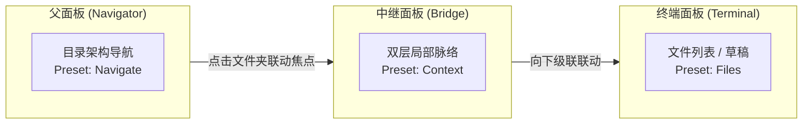

# Folder Spaces

[](https://github.com/edwardsayer/obsidian-folder-spaces/releases)
[](https://obsidian.md)
[](#兼容性与许可协议)
[](LICENSE)

> **将任意文件夹变成 Obsidian 中独立且可停靠的文件管理器工作空间，让你一次专注于单个上下文。**

---

语言：[English](README.md) | [繁體中文](README.zh-TW.md) | **简体中文**

仅支持桌面端 (Desktop only)。需要 Obsidian **1.7.2+**。

---

## 📑 目录

- [为什么需要 Folder Spaces？](#为什么需要-folder-spaces)
- [视觉展示](#-视觉展示)
- [主要功能](#主要功能)
- [视图预设规格对照表](#视图预设规格对照表)
- [多面板级联联动与点击分流](#多面板级联联动与点击分流)
- [安装方式](#-安装方式)
- [使用方式与操作速查表](#使用方式与操作速查表)
- [使用场景与工作流](#使用场景与工作流)
- [设置选项](#设置选项)
- [开发者 API](#开发者-api-developer-api)
- [兼容性与许可协议](#兼容性与许可协议)

---

## 为什么需要 Folder Spaces？

Obsidian 的默认文件管理器会一次显示整个存储库。当存储库成长为多个项目、主题与归档文件夹时，文件管理器会变成一张拥挤的地图——即使你只在乎其中一个文件夹，所有文件夹仍同时争夺你的注意力。

Folder Spaces 让你将任意文件夹抽离成独立且**聚焦的文件管理器**，只看到当前正在处理的上下文：

- 🎯 **一次只专注一个上下文** — 右键点击任意文件夹，即可将其作为独立的文件树打开。无关的文件夹从视野中消失，只剩下你在乎的项目、主题或任务。你同时享有单一存储库的优势（跨所有内容的链接、搜索与标签），又能在视觉上隔离的工作空间中专注工作。
- 🪟 **无干扰的弹出式窗口** — 在独立弹出式窗口中打开 Folder Space，将任务与主工作区的侧边栏、标签页分隔开来。在干净的窗口中工作，免去视觉干扰，也可放到副显示器使用。
- 🔗 **与 Window Spaces 搭配** — 搭配 [Window Spaces](https://github.com/edwardsayer/obsidian-window-spaces) 保存与还原这些布局。两者配合可将 Obsidian 打造成 **单一存储库、多项目、多主题的工作空间**：一个存储库、多个独立的专注窗口，各自围绕自己的文件夹上下文排列。

---

## 🖼️ 视觉展示

### 🔗 串联多面板联动（Cascading Panels / 类 Miller 列式导航）
将多个父子 Folder Space 面板在工作区中串联联动。在父面板切换文件夹时，已绑定的子面板将自动同步焦点，并实时于编辑区预览笔记。


| 🎯 单一目录侧边栏聚焦 | ⚙️ 7 种视图预设与扁平模式 | 🔍 单一标题栏与实时筛选 |
| :---: | :---: | :---: |
|  |  |  |
| *专属且聚焦的侧边栏总管，支持自定义图标，免除整库杂讯干扰* | *7 种预设（文件列表、导航、栏目、上下文、内容、文件、清单）与树状 / 扁平模式* | *精简原生单一标题栏，支持行内实时关键字筛选与快捷操作* |

---

## 主要功能

### 任意位置打开
- **文件夹右键菜单集成**：右键点击默认文件管理器中的任意文件夹，可通过 `Folder Spaces` 菜单打开：
  - 在默认位置打开
  - 在左侧边栏打开
  - 在右侧边栏打开
  - 在编辑区打开
  - 在新窗口打开
- **快速打开**：通过侧边栏功能区图标或 `打开 Folder Space` 命令搜索文件夹，并在默认位置打开。
- **从弹出式窗口内打开**：在弹出式窗口内执行命令或右键子菜单，新的 Folder Space 会在**同一个弹出式窗口**内打开——重用或创建全高左 / 右侧栏，或打开在弹出式窗口的编辑区——而不会跳回主窗口。
- **同窗口搜索**：当 Folder Space 位于弹出式窗口时，原生的 *Search in folder* 动作会在该弹出式窗口内显示搜索结果。
- **弹出式窗口中的侧边栏视图**：在弹出式窗口中打开任何原生侧边栏视图——标签、大纲、反向链接、outgoing links、属性、搜索等——并可在分割窗格 / 标签页组之间拖曳。

### 聚焦、独立的树
- **完全独立的文件检视**：打开专属且聚焦的 Folder Space 视图标签页，完全不影响 Obsidian 原生全存储库文件管理器。
- **树状与扁平视图模式**：每个文件夹可独立切换嵌套树状与干净的扁平列表。
- **展开层级控制**：展开 1 层、2 层或全部层级——每个文件夹可独立设置。
- **显示内容控制**：显示文件夹、文件或全部项目——每个文件夹可独立设置。
- **视图预设**：七个具名预设，组合视图、展开层级与内容。可应用于每个面板，也可在父面板驱动其子面板链时横向应用。
- **过滤与排序**：在当前面板按路径子字符串过滤，并按名称、修改时间或创建时间排序（升 / 降序）。排序方式会按文件夹记住；过滤条件是面板内即时应用的条件。
- **智能文件夹导航**：非终点文件夹保留原生展开 / 折叠行为；终点文件夹（例如已达到选定层级上限，或没有可显示的子项目）会在当前面板就地下钻，标题栏状态图标会变成返回上层按钮。
- **工作区布局恢复**：重启 Obsidian 后自动恢复已打开的 Folder Space 标签页。

### 单一标题栏与根目录操作
Folder Space 的标题栏是紧凑的单一标题栏，并保留原生文件操作：
- 显示当前根目录路径（截断显示，悬停以 tooltip 显示完整路径）。
- **点击根目录标题**：打开可搜索的文件夹选择器——返回上层文件夹，或直接跳到任意子文件夹。
- **右键点击根目录标题**：调用原生文件夹右键菜单 (`file-menu`)——包含新建笔记 / 新建文件夹等完整文件操作。
- **选择子文件夹 / 返回上层**操作：移动根目录范围。
- **标题栏操作**：过滤与排序各有独立按钮；`视图设置` 菜单可切换树状 / 扁平、展开层级 / 內容与预设；还可显示 / 自动显示当前文件、全部折叠 / 展开、设置自定义文件夹图标，或打开 Folder Spaces 设置。
- **根文件夹内联重命名**：按 Enter 确认，按 Escape 取消。
- **每个文件夹的设置**（视图、层级、内容、排序、图标）会被记住，并在文件夹重命名或移动时自动迁移。

### 面板保护与智能文件打开
- Folder Space 标签页受到保护，不会被一般笔记打开重用，因此侧边栏与弹出式窗口面板**不会被新打开的笔记取代**。从 Folder Space 打开的笔记会路由到可用的内容 / 编辑面板；如果目标笔记已固定，适当情况下会在该标签组新建标签。
- **编辑区智能路由**：Folder Space 位于编辑区时，普通点击文件会在同一窗口选择最近使用的相邻内容面板，并排除工具视图 (tool view) 与弹出式窗口侧栏。如果目标已固定，会在该标签组新建标签；如果没有其他内容面板，则由 **总是在其他面板打开** 设置决定是分割新面板，还是在当前标签组新建标签。
- Ctrl/Cmd 点击与中键点击保留明确新建标签的行为。弹出式窗口中的原生侧边栏视图面板（反向链接、大纲、outgoing links、搜索等）仍可在分割窗格 / 标签页组之间拖曳。

### 兼容性与生态
- **原生文件管理器核心**：Folder Space 重用 Obsidian 原生文件管理器的树状核心，因此拖放、键盘导航、右键菜单与 DOM 扩展都保持可用。
- **第三方文件管理器扩展**：CSS / DOM 装饰与 `data-*` 元素属性通常可通过兼容性桥接带入（事件处理器与内部状态不会复制）。
- **文件夹笔记 (Folder Notes) 感知**：可选择在纯文件夹视图中停用文件夹笔记打开，让点击文件夹专注于导航而非打开笔记。
- **开发者 Public API**：供第三方插件（如 Window Spaces）集成的稳定公开 API——见 [docs/api.zh-CN.md](docs/api.zh-CN.md)（亦提供 [英文版](docs/api.md)）。

---

## 视图预设规格对照表

Folder Spaces 提供 7 种结合**显示样式**、**展开层级**与**显示内容**的具名预设，以适配不同的工作空间角色：

| 预设 (Preset) | 显示样式 (Style) | 展开层级 (Depth) | 显示内容 (Content) | 最佳应用角色 / 使用场景 |
| :--- | :---: | :---: | :---: | :--- |
| 🗂️ **Explorer** | 树状 (Tree) | 全部层级 (All) | 全部项目 (All) | **标准文件管理器**：默认独立面板，与原生全存储库树状结构完全一致。 |
| 🧭 **Navigate** | 树状 (Tree) | 全部层级 (All) | 纯文件夹 (Folders) | **父侧导航器**：纯目录树结构，专注于层级浏览，去除文件杂讯。 |
| 🏛️ **Columns** | 树状 (Tree) | 单层 (1 level) | 纯文件夹 (Folders) | **直属导航器**：单层直属文件夹列表，宛如 macOS Finder 分栏式下钻。 |
| 🔍 **Context** | 树状 (Tree) | 双层 (2 levels) | 纯文件夹 (Folders) | **中继 Bridge 面板**：呈现两层目录结构脉络，作为中介联动节点。 |
| 📑 **Contents** | 扁平 (Flat) | 全部层级 (All) | 全部项目 (All) | **扁平结构总览**：按子文件夹分组呈现所有内容与文件。 |
| 📄 **Files** | 扁平 (Flat) | 全部层级 (All) | 纯文件 (Files) | **递归文件列表**：终端面板，快速浏览文件夹树下的所有文件。 |
| 📋 **List** | 扁平 (Flat) | 单层 (1 level) | 纯文件 (Files) | **直属文件列表**：干净呈现当前目录下的直接文件列表。 |

---

## 多面板级联联动与点击分流

将 Folder Space 面板连接成 `Parent → Child → Grandchild` 级联链，跨面板带动文件夹上下文：



- **自动绑定**：在任一 Folder Space（或原生文件管理器）中右键点击文件夹并打开新面板——新面板**自动绑定为来源面板的子面板**。
- **联动开关**：子面板标题栏设有 **"与父面板文件夹焦点同步"** 开关按钮；开启时父面板点击任何文件夹，子面板范围即刻跟随；关闭时则冻结子面板范围。
- **原生文件管理器支持**：Obsidian 原生文件管理器亦可直接作为最顶层的父面板，点击即可带动子 Folder Space。
- **无限级联深度**：子面板可再次作为父面板打开下一级子面板，焦点沿整条链下传，并内置完整的循环联动保护。

### 智能点击三段分流 (Smart 3-Zone Click Dispatch)

Folder Space 将文件夹项目划分为三段独立点击热区，确保操作精准可预期：

| 点击命中区域 | 单面板模式（联动关闭） | 双面板模式（子面板联动中） | 行为细节 |
| :--- | :--- | :--- | :--- |
| **Chevron 箭头** | 展开 / 折叠目录 | 展开 / 折叠目录 | 始终维持父面板树状展开状态不变。 |
| **文件夹名称 (Name)** | 打开文件夹笔记 (若存在) / 折叠 | 发送焦点并导航子面板 | 若有文件夹笔记 (Folder Note) 则打开笔记（悬停显示下划线提示）。 |
| **行背景 / 空白区** | 就地下钻 (Drill-down) | 发送焦点并导航子面板 | 即时切换范围，不扰动当前树状展开状态。 |
| **长按 (450ms)** | 就地下钻 (Drill-down) | 就地下钻 (Drill-down) | 在父面板原地切换根目录，不联动子面板。 |

---

## 📥 安装方式

### 通过 Obsidian 社区插件市场安装 *(推荐)*
1. 打开 Obsidian **设置** > **第三方插件**。
2. 关闭"安全模式"，点击"浏览"。
3. 搜索 **Folder Spaces**。
4. 点击 **安装**，完成后点击 **启用**。

### 通过 BRAT 安装测试版 (Beta Testing)
1. 在社区插件市场中安装 [BRAT 插件](https://github.com/TfTHacker/obsidian42-brat)。
2. 打开命令面板 (`Ctrl/Cmd + P`)，执行 **`BRAT: Add a beta plugin for testing`**。
3. 输入仓库地址：`https://github.com/edwardsayer/obsidian-folder-spaces`。
4. 点击 **Add Plugin**，安装完成后启用 **Folder Spaces**。

### 手动安装
1. 从最新版 [GitHub Releases](https://github.com/edwardsayer/obsidian-folder-spaces/releases) 下载 `main.js`、`manifest.json` 与 `styles.css`。
2. 在您的存储库插件目录创建文件夹：`<vault>/.obsidian/plugins/folder-spaces/`。
3. 将下载的 3 个文件放入该文件夹。
4. 重载 Obsidian (`Ctrl/Cmd + R`)，并在 **设置 > 第三方插件** 中启用 **Folder Spaces**。

---

## 使用方式与操作速查表

### 基本使用
1. 打开 Obsidian 默认文件管理器。
2. 右键点击任意文件夹。
3. 悬停至 `Folder Spaces` 并选择打开位置（默认位置、左侧边栏、右侧边栏、编辑区或新窗口）。
4. 在新打开的 Folder Space 标签页中浏览与操作。点击标题栏的根目录标题可通过文件夹选择器切换根目录、切换树状 / 扁平视图，或应用预设。

### 常用操作与快捷键速查

| 操作目标 | 操作方式 | 功能说明 |
| :--- | :--- | :--- |
| **快速打开** | `Ctrl/Cmd + P` ➔ `打开 Folder Space` | 打开文件夹选择器，并在默认位置打开 |
| **功能区图标** | 点击左侧边栏 Ribbon 图标 | 快速打开文件夹选择器 |
| **右键菜单** | 右键点击任意文件夹 ➔ `Folder Spaces` | 选择在左侧栏、右侧栏、编辑区或新窗口打开 |
| **更换根目录** | 点击标题栏文件夹名称 | 弹出选择器跳转至其他文件夹或返回上层 |
| **文件夹动作** | 右键点击标题栏文件夹名称 | 调用原生文件夹右键菜单（新建笔记 / 文件夹等完整动作） |
| **重命名** | 双击或选中标题栏名称按 `Enter` | 内联重命名根目录（按 `Enter` 保存，`Esc` 取消） |
| **联动开关** | 点击标题栏的联动图标按钮 | 开启 / 关闭子面板跟随父面板焦点 |
| **路径过滤** | 点击标题栏过滤按钮 (`Filter`) | 输入关键字即时过滤当前面板中的路径 |
| **排序方式** | 点击标题栏排序按钮 (`Sort`) | 按名称、创建日期、修改日期进行升 / 降序排序 |
| **视图设置** | 点击标题栏设置按钮 | 切换树状 / 扁平、层级限制 (1 / 2 / 全部)、内容过滤或预设 |

---

## 使用场景与工作流

把每个 Folder Space 视为一个**专注空间 (Focus Room)**，用于单个项目、主题或工作流程：

- **项目工作区** (`Projects/<name>`)：将 Folder Space 根目录设为当前项目。该项目所有的规格、笔记与资源尽在一棵树中，无关的项目完全不出现在视野中。
- **写作与内容制作** (`Writing/`)：在自己的空间中打开写作文件夹——使用 `Contents` / `Files` 预设或扁平视图将所有草稿以干净列表呈现。
- **研究与文献** (`Research/`)：将文献或主题文件夹独立出来，让阅读笔记与来源资料保持在单一专注的上下文。
- **扁平结构扫描**：对深度嵌套的文件夹，切换到扁平视图即可一眼看到所有子文件夹（标注相对路径）与其中的文件。
- **左右并读**：将 Folder Space 放在编辑区并启用 **总是在其他面板打开**，普通点击文件即可在相邻内容面板打开。
- **多面板级联**：串起 `Navigate`（或 `Columns`）纯文件夹导航器 → `Context` 中转 → `Contents` / `Files` 终端，逐步下钻大型结构，同时让每个层级保持专注。
- **无干扰的深度工作**：在弹出式窗口中打开 Folder Space 并置于副显示器，让任务上下文完全与主工作区分离。
- **单一存储库多项目工作空间**：将 Folder Spaces 与 Window Spaces 结合。每个项目拥有聚焦于指定文件夹的文件管理器与保存的窗口排列，像项目"房间"一样切换。

---

## 设置选项

- **常规**
  - **显示功能区图标**：在侧边栏功能区显示 Folder Space 图标以打开文件夹选择器。
  - **总是在其他面板打开**：Folder Space 位于编辑 / 内容区时，普通点击文件会在相邻内容面板打开；如果没有其他面板则分割新面板。关闭后会在当前标签组新建标签。
- **默认打开位置**：新 Folder Space 打开的位置——**主窗口**与**弹出式窗口**可分别设置（左侧边栏、右侧边栏、编辑区或新窗口）。
- **视图预设**
  - **默认视图预设**：新建独立面板应用的预设。
  - **在纯文件夹视图中禁用文件夹笔记**：让纯文件夹导航专注于层级；按住 Ctrl/Cmd 点击仍可打开文件夹笔记。
- **级联与联动**：设置默认子面板预设、自动应用、自适应父面板模式、父面板导航预设，以及分别针对同窗口 / 新窗口子面板设置默认联动行为。
- **预设规格对照表**：设置页包含七个内置预设的 Tree/Flat、层级与内容维度说明。

---

## 开发者 API (Developer API)

第三方插件可通过以下方式访问 API：

```typescript
const api = app.plugins.plugins["folder-spaces"]?.api;
if (api) {
  const isFolderSpace = api.isFolderSpaceView(leaf);
  const folderPath = api.getFolderPath(leaf);
  const spaces = api.getFolderSpaces();
  await api.openFolderSpace("Projects/Active", "left-sidebar");
}
```

完整的 API 参考见 [docs/api.zh-CN.md](docs/api.zh-CN.md)（亦提供 [英文版](docs/api.md)）。

---

## 兼容性与许可协议

- **Obsidian 版本**: `1.7.2+`
- **支持平台**: 仅限桌面版 (Windows, macOS, Linux)
- **许可协议**: [MIT](LICENSE)
