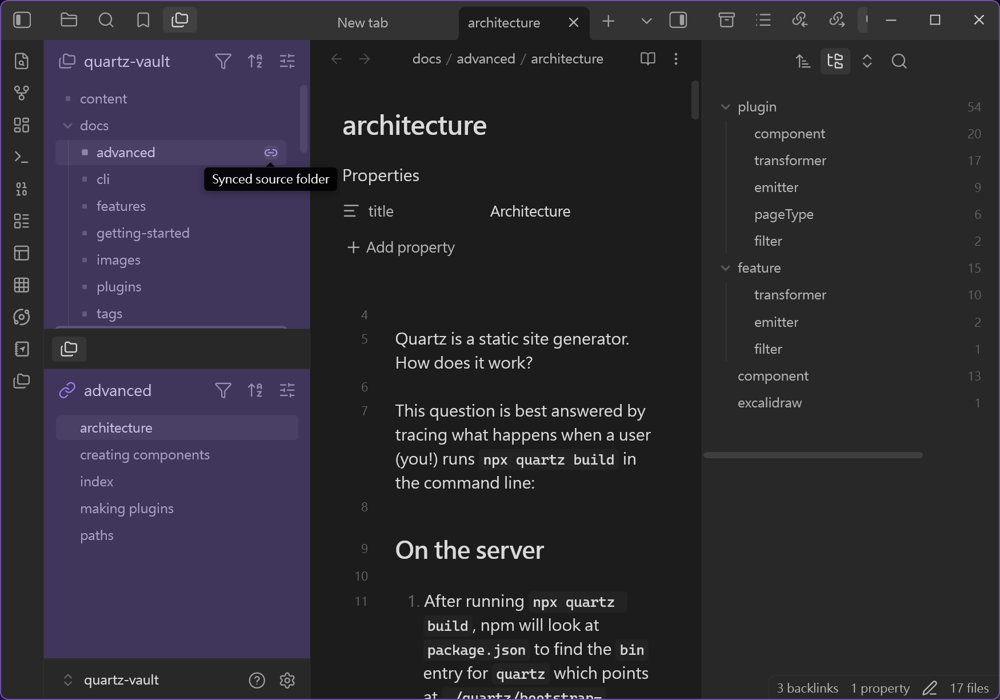
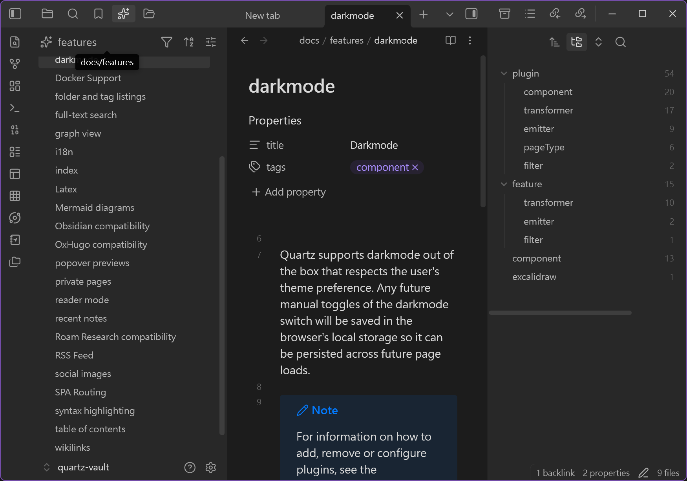
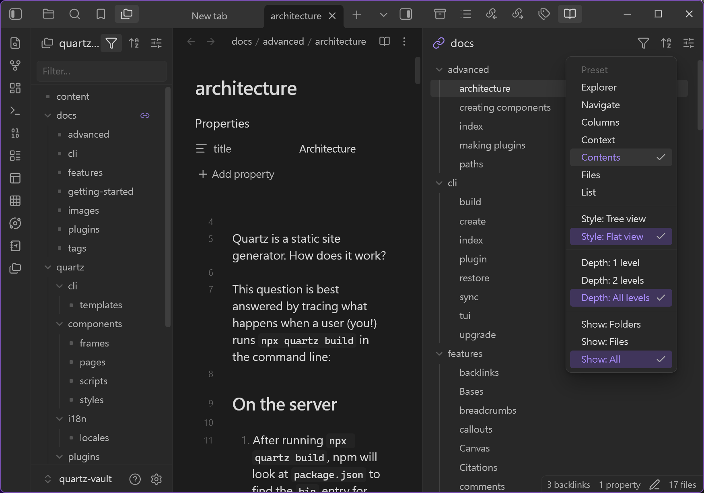
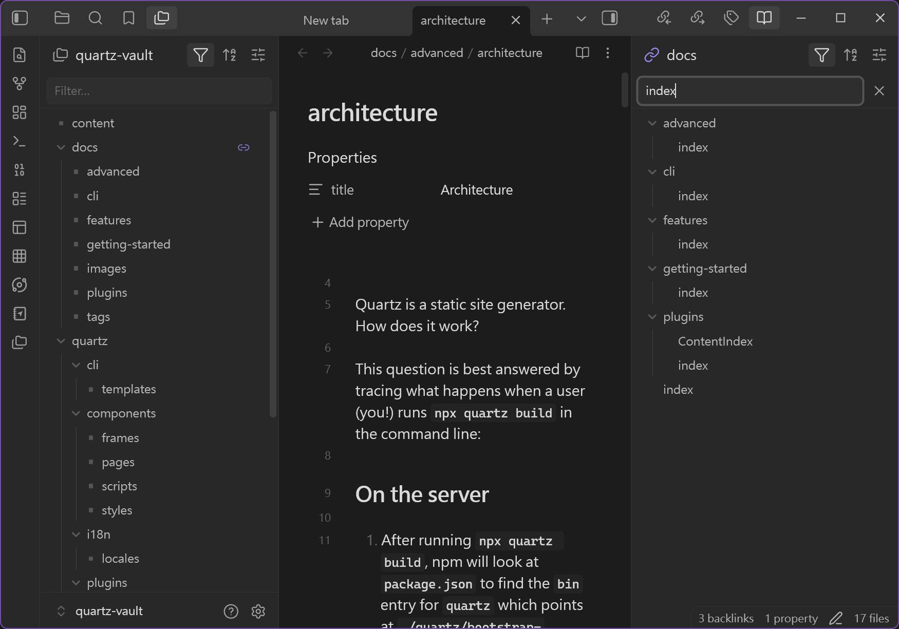
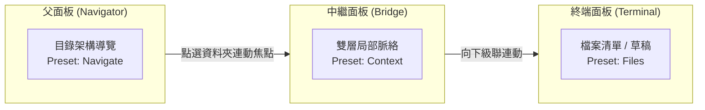

# Folder Spaces

[](https://github.com/edwardsayer/obsidian-folder-spaces/releases)
[](https://obsidian.md)
[](#相容性與授權條款)
[](LICENSE)

> **將任意資料夾變成 Obsidian 中獨立且可停駐的檔案總管工作空間，讓你一次專注於單一上下文。**

---

語言：[English](README.md) | **繁體中文** | [簡體中文](README.zh-CN.md)

僅支援桌面端 (Desktop only)。需要 Obsidian **1.7.2+**。

---

## 📑 目錄

- [為什麼需要 Folder Spaces？](#為什麼需要-folder-spaces)
- [視覺展示](#-視覺展示)
- [主要功能](#主要功能)
- [檢視預設集規格對照表](#檢視預設集規格對照表)
- [多面板接龍連動與點擊分流](#多面板接龍連動與點擊分流)
- [安裝方式](#-安裝方式)
- [使用方式與操作速查表](#使用方式與操作速查表)
- [使用情境與工作流](#使用情境與工作流)
- [設定選項](#設定選項)
- [開發者 API](#開發者-api-developer-api)
- [相容性與授權條款](#相容性與授權條款)

---

## 為什麼需要 Folder Spaces？

Obsidian 的預設檔案總管會一次顯示整個儲存庫。當儲存庫成長為多個專案、主題與封存資料夾時，檔案總管會變成一張擁擠的地圖——即使你只在乎其中一個資料夾，所有資料夾仍同時爭奪你的注意力。

Folder Spaces 讓你將任意資料夾抽離成獨立且**聚焦的檔案總管**，只看得到目前正在處理的上下文：

- 🎯 **一次只專注一個上下文** — 對任意資料夾按右鍵，即可將其作為獨立的檔案樹開啟。無關的資料夾從視野中消失，只剩下你在乎的專案、主題或任務。你同時享有單一儲存庫的優勢（跨所有內容的連結、搜尋與標籤），又能在視覺上隔離的工作空間中專注作業。
- 🪟 **無干擾的彈出式視窗** — 在獨立彈出式視窗中開啟 Folder Space，將任務與主工作區的側邊欄、分頁區隔開來。在乾淨的視窗中作業，免除視覺干擾，也可放到副螢幕使用。
- 🔗 **與 Window Spaces 搭配** — 搭配 [Window Spaces](https://github.com/edwardsayer/obsidian-window-spaces) 保存與還原這些佈局。兩者配合可將 Obsidian 打造成 **單一儲存庫、多專案、多主題的工作空間**：一個儲存庫、多個獨立的專注視窗，各自圍繞自己的資料夾上下文排列。

---

## 🖼️ 視覺展示

### 🔗 串聯多面板聯動（Cascading Panels / 類 Miller 欄位導覽）
將多個父子 Folder Space 面板在工作區中串聯聯動。在父面板切換資料夾時，已綁定的子面板將自動同步焦點，並即時於編輯區預覽筆記。



| 🎯 單一目錄側邊欄聚焦 | ⚙️ 7 種檢視預設集與扁平模式 | 🔍 單一標題列與即時篩選 |
| :---: | :---: | :---: |
|  |  |  |
| *專屬且聚焦的側邊欄總管，支援自訂圖示，免除整庫雜訊干擾* | *7 種預設集（檔案總管、導覽、欄位、脈絡、內容、檔案、清單）與樹狀 / 扁平模式* | *精簡原生單一標題列，支援行內即時關鍵字篩選與快速操作* |

---

## 主要功能

### 任意位置開啟
- **資料夾右鍵選單整合**：對預設檔案總管中的任意資料夾按右鍵，即可透過 `Folder Spaces` 選單開啟：
  - 在預設位置開啟
  - 在左側邊欄開啟
  - 在右側邊欄開啟
  - 在編輯區開啟
  - 在新視窗開啟
- **快速開啟**：透過側邊欄功能區圖示或 `開啟 Folder Space` 指令搜尋資料夾，並在預設位置開啟。
- **從彈出式視窗內開啟**：在彈出式視窗內執行指令或右鍵子選單，新的 Folder Space 會在**同一個彈出式視窗**內開啟——重用或建立全高左 / 右側欄，或開啟在彈出式視窗的編輯區——而不會跳回主視窗。
- **同視窗搜尋**：當 Folder Space 位於彈出式視窗時，原生 *Search in folder* 動作會在該彈出式視窗內顯示搜尋結果。
- **彈出式視窗中的側邊欄檢視**：在彈出式視窗中開啟任何原生側邊欄檢視——標籤、大綱、反向連結、outgoing links、屬性、搜尋等——並可在分割窗格 / 標籤頁群組之間拖曳。

### 聚焦、獨立的樹
- **完全獨立的資料夾檢視**：開啟專屬且聚焦的 Folder Space 檢視頁籤，完全不影響 Obsidian 原生全儲存庫檔案總管。
- **樹狀與扁平檢視模式**：每個資料夾可獨立切換巢狀樹狀與乾淨的扁平清單。
- **展開層級控制**：展開 1 層、2 層或全部層級——每個資料夾可獨立設定。
- **顯示內容控制**：顯示資料夾、檔案或全部項目——每個資料夾可獨立設定。
- **檢視預設集**：七個具名預設集，組合檢視、展開層級與內容。可套用於每個面板，也可在父面板驅動其子面板鏈時水平套用。
- **過濾與排序**：在目前面板依路徑子字串過濾，並依名稱、修改時間或建立時間排序（升 / 降冪）。排序方式會按資料夾記住；過濾條件是面板內即時套用的條件。
- **智慧資料夾導覽**：非端點資料夾保留原生展開 / 收合行為；端點資料夾（例如已達選定層級上限，或沒有可顯示子項目）會在目前面板就地下鑽，標題列狀態圖示會變成返回上層按鈕。
- **工作區佈局還原**：重啟 Obsidian 後自動恢復所有已開啟的 Folder Space 頁籤。

### 單一標題列與根目錄操作
Folder Space 的標題列是緊湊的單一標題列，並保留原生檔案動作：
- 顯示目前根目錄路徑（截斷顯示，滑鼠懸停以 tooltip 顯示完整路徑）。
- **點擊根目錄標題**：開啟可搜尋的資料夾選擇器——返回上層資料夾，或直接跳到任一子資料夾。
- **對根目錄標題按右鍵**：呼叫原生資料夾右鍵選單 (`file-menu`)——包含新增記事 / 新增資料夾等完整檔案動作。
- **選取子資料夾 / 返回上層**動作：移動根目錄範圍。
- **標題列操作**：過濾與排序各有獨立按鈕；`檢視設定` 選單可切換樹狀 / 扁平、展開層級 / 內容與預設集；另可顯示 / 自動顯示目前檔案、全部收合 / 展開、設定自訂資料夾圖示，或開啟 Folder Spaces 設定。
- **根資料夾內嵌重新命名**：按 Enter 確認，按 Escape 取消。
- **每個資料夾的設定**（檢視、層級、內容、排序、圖示）會被記住，並在資料夾更名或搬移時自動遷移。

### 面板保護與智慧檔案開啟
- Folder Space 頁籤受到保護，不會被一般記事開啟重用，因此側邊欄與彈出式視窗面板**不會被新開啟的記事取代**。從 Folder Space 開啟的記事會導向可用的內容 / 編輯面板；若目標記事已釘選，適當情況下會在該群組開新分頁。
- **編輯區智慧路由**：Folder Space 位於編輯區時，普通點擊檔案會在同一視窗選擇最近使用的相鄰內容面板，並排除工具檢視 (tool view) 與彈出式視窗側欄。若目標已釘選，會在該群組建立新分頁；若沒有其他內容面板，則由 **總是在其他面板開啟** 設定決定要分割新面板，或在目前群組建立分頁。
- Ctrl/Cmd 點擊與中鍵點擊保留明確開新分頁的行為。彈出式視窗中的原生側邊欄檢視面板（反向連結、大綱、outgoing links、搜尋等）仍可在分割窗格 / 標籤頁群組間拖曳。

### 相容性與生態系
- **原生檔案總管核心**：Folder Space 重用 Obsidian 原生檔案總管的樹狀核心，因此拖曳、鍵盤導覽、右鍵選單與 DOM 擴充都保持可用。
- **第三方檔案總管擴充**：CSS / DOM 裝飾與 `data-*` 元素屬性通常可透過相容性 bridge 帶入（事件處理器與內部狀態不會複製）。
- **資料夾記事 (Folder Notes) 感知**：可選擇在純資料夾檢視中停用資料夾記事開啟，讓點擊資料夾專注於導覽而非開啟記事。
- **開發者 Public API**：供第三方外掛（如 Window Spaces）整合的穩定公開 API——見 [docs/api.zh-TW.md](docs/api.zh-TW.md)（亦提供 [英文版](docs/api.md)）。

---

## 檢視預設集規格對照表

Folder Spaces 提供 7 種結合**顯示樣式**、**展開層級**與**顯示內容**的具名預設集，以適配不同的工作空間角色：

| 預設集 (Preset) | 顯示樣式 (Style) | 展開層級 (Depth) | 顯示內容 (Content) | 最佳應用角色 / 使用情境 |
| :--- | :---: | :---: | :---: | :--- |
| 🗂️ **Explorer** | 樹狀 (Tree) | 全部層級 (All) | 全部項目 (All) | **標準檔案總管**：預設獨立面板，與原生全儲存庫樹狀結構完全相同。 |
| 🧭 **Navigate** | 樹狀 (Tree) | 全部層級 (All) | 純資料夾 (Folders) | **父側導覽器**：純目錄樹結構，專注於層級瀏覽，去除檔案雜訊。 |
| 🏛️ **Columns** | 樹狀 (Tree) | 單層 (1 level) | 純資料夾 (Folders) | **直屬導覽器**：單層直屬資料夾清單，宛如 macOS Finder 欄位式下鑽。 |
| 🔍 **Context** | 樹狀 (Tree) | 雙層 (2 levels) | 純資料夾 (Folders) | **中繼 Bridge 面板**：呈現兩層目錄結構脈絡，作為中介連動節點。 |
| 📑 **Contents** | 扁平 (Flat) | 全部層級 (All) | 全部項目 (All) | **扁平結構總覽**：依子資料夾分組呈現所有內容與檔案。 |
| 📄 **Files** | 扁平 (Flat) | 全部層級 (All) | 純檔案 (Files) | **遞迴檔案清單**：終端面板，快速瀏覽資料夾樹下的所有檔案。 |
| 📋 **List** | 扁平 (Flat) | 單層 (1 level) | 純檔案 (Files) | **直屬檔案清單**：乾淨呈現目前目錄下的直接檔案清單。 |

---

## 多面板接龍連動與點擊分流

將 Folder Space 面板連結成 `Parent → Child → Grandchild` 級聯鏈，跨面板帶動資料夾上下文：



- **自動綁定**：在任一 Folder Space（或原生檔案總管）中對資料夾按右鍵並開啟新面板——新面板**自動綁定為來源面板的子面板**。
- **連動開關**：子面板標題列設有 **「與父面板資料夾焦點連動」** 開關按鈕；開啟時父面板點選任何資料夾，子面板範圍即刻跟隨；關閉時則凍結子面板範圍。
- **原生總管支援**：Obsidian 原生檔案總管亦可直接作為最頂層的父面板，點選即可帶動子 Folder Space。
- **無限級聯深度**：子面板可再次作為父面板開啟下一級子面板，焦點沿整條鏈下傳，並內建完整的循環連動防護。

### 智慧點擊三段分流 (Smart 3-Zone Click Dispatch)

Folder Space 將資料夾項目劃分為三段獨立點擊熱區，確保操作精準可預期：

| 點擊命中區域 | 單面板模式（連動關閉） | 雙面板模式（子面板連動中） | 行為細節 |
| :--- | :--- | :--- | :--- |
| **Chevron 箭頭** | 開啟 / 收合目錄 | 開啟 / 收合目錄 | 始終維持父面板樹狀開合狀態不變。 |
| **資料夾名稱 (Name)** | 開啟資料夾記事 (若存在) / 開合 | 傳送焦點並導航子面板 | 若有資料夾記事 (Folder Note) 則開啟記事（滑鼠懸停顯示底線提示）。 |
| **行背景 / 空白區** | 就地下鑽 (Drill-down) | 傳送焦點並導航子面板 | 即時切換範圍，不擾動目前樹狀展開狀態。 |
| **長按 (450ms)** | 就地下鑽 (Drill-down) | 就地下鑽 (Drill-down) | 在父面板原地切換根目錄，不連動子面板。 |

---

## 📥 安裝方式

### 透過 Obsidian 社群外掛商店安裝 *(推薦)*
1. 開啟 Obsidian **設定** > **社群外掛**。
2. 關閉「受限模式」，點擊「瀏覽」。
3. 搜尋 **Folder Spaces**。
4. 點擊 **安裝**，完成後點擊 **啟用**。

### 透過 BRAT 安裝測試版 (Beta Testing)
1. 在社群外掛商店中安裝 [BRAT 外掛](https://github.com/TfTHacker/obsidian42-brat)。
2. 開啟指令面板 (`Ctrl/Cmd + P`)，執行 **`BRAT: Add a beta plugin for testing`**。
3. 輸入儲存庫網址：`https://github.com/edwardsayer/obsidian-folder-spaces`。
4. 點擊 **Add Plugin**，安裝完成後啟用 **Folder Spaces**。

### 手動安裝
1. 從最新版 [GitHub Releases](https://github.com/edwardsayer/obsidian-folder-spaces/releases) 下載 `main.js`、`manifest.json` 與 `styles.css`。
2. 在您的儲存庫外掛目錄建立資料夾：`<vault>/.obsidian/plugins/folder-spaces/`。
3. 將下載的 3 個檔案放入該資料夾。
4. 重載 Obsidian (`Ctrl/Cmd + R`)，並在 **設定 > 社群外掛** 中啟用 **Folder Spaces**。

---

## 使用方式與操作速查表

### 基本使用
1. 開啟 Obsidian 預設檔案總管。
2. 對任意資料夾按右鍵。
3. 選擇 `Folder Spaces` 並挑選開啟位置（預設位置、左側邊欄、右側邊欄、編輯區或新視窗）。
4. 在新開啟的 Folder Space 頁籤中瀏覽與操作。點擊標題列的根目錄標題可透過資料夾選擇器切換根目錄、切換樹狀 / 扁平檢視，或套用預設集。

### 常用操作與快捷鍵速查

| 操作目標 | 操作方式 | 功能說明 |
| :--- | :--- | :--- |
| **快速開啟** | `Ctrl/Cmd + P` ➔ `開啟 Folder Space` | 開啟資料夾選擇器，並在預設位置開啟 |
| **功能區圖示** | 點擊左側邊欄 Ribbon 圖示 | 快速開啟資料夾選擇器 |
| **右鍵選單** | 對任意資料夾按右鍵 ➔ `Folder Spaces` | 選擇在左側欄、右側欄、編輯區或新視窗開啟 |
| **更換根目錄** | 點擊標題列資料夾名稱 | 彈出選擇器跳轉至其他資料夾或返回上層 |
| **資料夾動作** | 右鍵點擊標題列資料夾名稱 | 呼叫原生資料夾右鍵選單（新增記事 / 新增資料夾等完整動作） |
| **重新命名** | 雙擊或選取標題列名稱按 `Enter` | 內聯重新命名根目錄（按 `Enter` 儲存，`Esc` 取消） |
| **連動開關** | 點擊標題列的連動圖示按鈕 | 開啟 / 關閉子面板跟隨父面板焦點 |
| **路徑篩選** | 點擊標題列篩選按鈕 (`Filter`) | 輸入關鍵字即時篩選目前面板中的路徑 |
| **排序方式** | 點擊標題列排序按鈕 (`Sort`) | 依名稱、建立日期、修改日期進行升 / 降冪排序 |
| **檢視設定** | 點擊標題列設定按鈕 | 切換樹狀 / 扁平、層級限制 (1 / 2 / 全部)、內容篩選或預設集 |

---

## 使用情境與工作流

把每個 Folder Space 視為一個**專注空間 (Focus Room)**，用於單一專案、主題或工作流程：

- **專案工作區** (`Projects/<name>`)：將 Folder Space 根目錄設為目前專案。該專案的所有規格、記事與資源盡在一棵樹中，無關的專案完全不出現在視野中。
- **寫作與內容製作** (`Writing/`)：在自己的空間中開啟寫作資料夾——使用 `Contents` / `Files` 預設集或扁平檢視將所有草稿以乾淨清單呈現。
- **研究與文獻** (`Research/`)：將文獻或主題資料夾獨立出來，讓閱讀記事與來源資料保持在單一專注的上下文。
- **扁平結構掃描**：對深度巢狀的資料夾，切換到扁平檢視即可一眼看到所有子資料夾（標示相對路徑）與其中的檔案。
- **左右並讀**：將 Folder Space 放在編輯區並啟用 **總是在其他面板開啟**，普通點擊檔案即可在相鄰內容面板開啟。
- **多面板接龍**：串起 `Navigate`（或 `Columns`）純資料夾導覽器 → `Context` 中繼 → `Contents` / `Files` 終端，逐步下鑽大型結構，同時讓每個層級保持專注。
- **無干擾的深度工作**：在彈出式視窗中開啟 Folder Space 並置於副螢幕，讓任務上下文完全與主工作區分離。
- **單一儲存庫多專案工作空間**：將 Folder Spaces 與 Window Spaces 結合。每個專案擁有聚焦於指定資料夾的檔案總管與保存的視窗排列，像專案「房間」一樣切換。

---

## 設定選項

- **一般**
  - **顯示功能區圖示**：在側邊欄功能區顯示 Folder Space 圖示以開啟資料夾選擇器。
  - **總是在其他面板開啟**：Folder Space 位於編輯 / 內容區時，普通點擊檔案會在相鄰內容面板開啟；若沒有其他面板則分割新面板。關閉後會在目前群組建立分頁。
- **預設開啟位置**：新 Folder Space 開啟的位置——**主視窗**與**彈出式視窗**可分別設定（左側邊欄、右側邊欄、編輯區或新視窗）。
- **檢視預設集**
  - **預設檢視預設集**：新獨立面板套用的預設集。
  - **在純資料夾檢視中停用資料夾記事**：讓純資料夾導覽專注於層級；按住 Ctrl/Cmd 點擊仍可開啟資料夾記事。
- **接龍與連動**：設定預設子面板預設集、自動套用、自適應父面板模式、父面板導覽預設集，以及分別針對同視窗 / 新視窗子面板設定預設連動行為。
- **預設集規格對照表**：設定頁包含七個內建預設集的 Tree/Flat、層級與內容維度說明。

---

## 開發者 API (Developer API)

第三方外掛可透過以下方式存取 API：

```typescript
const api = app.plugins.plugins["folder-spaces"]?.api;
if (api) {
  const isFolderSpace = api.isFolderSpaceView(leaf);
  const folderPath = api.getFolderPath(leaf);
  const spaces = api.getFolderSpaces();
  await api.openFolderSpace("Projects/Active", "left-sidebar");
}
```

完整的 API 參考見 [docs/api.zh-TW.md](docs/api.zh-TW.md)（亦提供 [英文版](docs/api.md)）。

---

## 相容性與授權條款

- **Obsidian 版本**: `1.7.2+`
- **支援平台**: 僅限桌面版 (Windows, macOS, Linux)
- **授權條款**: [MIT](LICENSE)
