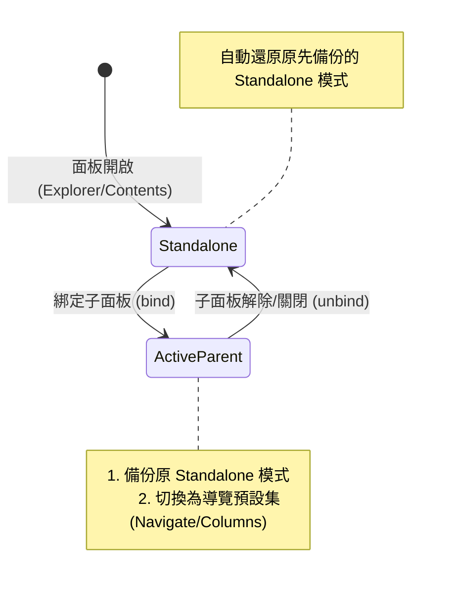

# 多面板接龍連動與檢視預設集架構設計規範 (Cascade Panel &amp; View Presets Architecture)

> **版本**：v2.0 (2026-08-18)  
> **狀態**：核心架構已實作完成、通過完整單元測試與 CDP 實機驗證。  
> **關聯模組**：`src/panel-binding.ts`, `src/presets.ts`, `src/folder-space-explorer.ts`, `src/settings.ts`, `src/ui/settings-tab.ts`, `src/main.ts`。

---

## 1. 系統架構與設計哲學 (Architecture &amp; Philosophy)

### 1.1 核心理念：重用原生 Explorer 內核

Folder Spaces 的核心資產是**重用 Obsidian 原生 File Explorer 的 Rich Tree 內核**。這意味著：

- 拖曳（Drag &amp; Drop）、快捷鍵導航、右鍵選單（Context Menu）、原生搜尋篩選、以及 DOM 裝飾擴充（如相容其他外掛）均完整保留，無需從零重造。
- 透過 View 猴子補丁（Monkey Patch）與葉面封裝（Navigable Leaf），將資料夾樹限制在指定的 `folderPath` 範圍內。

### 1.2 無限深度接龍連動（Multi-Level Cascade）

多個 Folder Space 面板可以透過「父子連動（Parent-Child Binding）」串接成一條任意長度的級聯鏈條（`Parent → Child → Grandchild → ...`），並具備完整的循環依賴防護與生命週期同步（`reconcile()`）。

在接龍連動鏈中，各面板承擔不同的職責：

- **Navigator（父側導覽）**：專注於挑選目錄向下傳遞，避免檔案雜訊干擾。
- **Bridge（中繼脈絡）**：展示局部的 2 層目錄樹，可同時作為下級的導覽器。
- **Terminal（終端消費）**：展示完整的檔案與內容列表供使用者操作與閱讀。

---

## 2. 父子連動互動機制 (Interaction Mechanics &amp; Event Routing)

### 2.1 點擊行為的語意分工

在多面板連動情境下，傳統「點擊資料夾名稱即展開樹狀目錄」的行為會與「點擊目錄下傳至子面板」發生衝突。因此實作明確劃分兩種點擊語意：

| 點擊目標                         | 父面板行為              | 子面板行為           | 備註                 |
| :---------------------------- | :------------------ | :--------------- | :------------------ |
| **資料夾名稱**                    | **不**展開/收合目錄（維持原貌） | **跟隨（切換至該子路徑）** | 語意為「導航（下鑽）」        |
| **前端箭頭（Chevron）**            | 展開/收合目錄（Toggle）    | **不**跟隨（保持原路徑）  | 語意為「瀏覽目錄結構」        |
| **帶 Modifier 點擊 (Ctrl/Cmd)** | 執行原生點擊行為           | 不跟隨             | 保留進階使用者操作          |
| **連動關閉 (Follow OFF) 或無子面板**  | 恢復原生點擊行為           | 不受影響            | 獨立面板完全如原生 Explorer |

### 2.2 雙監聽器架構（與第三方插件相容）

為避免粗暴使用 `stopPropagation()` 導致第三方外掛（例如 `folder-notes` 開啟筆記）失效，系統採用**雙層事件監聽器設計**：

1. **Window-Capture 階段（唯讀驅動）**：
  - 優先於任何 document/container 層級捕獲事件。
  - 解析點擊的資料夾路徑，觸發 `manager.propagateFrom(parentId, folderPath)`。
  - **不阻斷傳播**（不呼叫 `stopPropagation()`），讓後續的 `folder-notes` 能順利接收事件並開啟資料夾筆記。
2. **Container-Capture 階段（阻擋 Toggle）**：
  - 僅在綁定子面板存在且開啟連動時生效。
  - 攔截資料夾名稱的點擊，呼叫 `event.preventDefault()` 與 `event.stopPropagation()`，精準阻斷原生 Explorer 的展開/收合行為。
3. **原生 File Explorer 支援**：
  - 原生 File Explorer 亦透過 `createNativeExplorerBinding` 具備完全相同的雙監聽器機制，當其作為父面板時亦享有一致的互動體驗。

---

## 3. 檢視預設集體系 (View Presets System)

將 `(viewMode, depthMode, contentMode)` 三個維度封裝為 6 種對稱、語意精準的預設集：

| 分類        | Preset ID  | 檢視模式 (View) | 展開層級 (Depth) | 顯示內容 (Content) | 適用角色與語意                               |
| :--------- | :---------- | :----------- | :------------ | :-------------- | :------------------------------------- |
| **全功能總管** | `explorer` | `tree`      | `all-level`  | `all`          | **標準檔案總管**（獨立面板最常用預設：全層級目錄 + 檔案）      |
| **資料夾導覽** | `navigate` | `tree`      | `all-level`  | `folders`      | **完整目錄樹**（純目錄導覽，Cascade 父側 Navigator） |
|           | `columns`  | `tree`      | `one-level`  | `folders`      | **Finder 欄位導覽**（單層子目錄，極簡父側導航）         |
|           | `context`  | `tree`      | `two-level`  | `folders`      | **脈絡導覽**（雙層子目錄，Cascade 中繼 Bridge 面板）  |
| **扁平總覽**  | `contents` | `flat`      | `all-level`  | `all`          | **內容總覽**（扁平群組化呈現所有目錄與檔案）              |
|           | `files`    | `flat`      | `all-level`  | `files`        | **純檔案清單**（遞迴列出所有檔案，無目錄節點）             |

### 3.1 規則與一致性保證

- **Depth 限制在 Tree 與 Flat 模式下皆完整生效**：
  - **Tree 模式**：Depth 控制目錄樹層級展開上限（超出深度之子項目予以隱藏並收合）。
  - **Flat 模式**：Depth 控制遞迴收集資料夾群組的深度（例如 `one-level` 僅收集第 1 層資料夾群組；`two-level` 收集至第 2 層；`all-level` 遞迴收集所有層級群組）。
- **ContentMode `files` 自動強制為 Flat**：由 `presetToState()` 保證一致性（純檔案清單自動以 Flat 呈現，並顯示所在相對路徑標籤）。
- **比對與識別**：由 `matchPreset()` 精確比對當前面板的三個維度 `(viewMode, depthMode, contentMode)`；若使用者調整為非標準組合（例如 `flat / one-level / all`），選單將精準標示為「自訂（Custom）」。

---

## 4. 接龍自適應父面板模式 (Adaptive Cascade Parent)

### 4.1 動態角色自適應機制

當面板「有子面板連動（成為 Parent / Navigator）」與「單獨存在（Standalone）」時，使用者所需的檢視重點截然不同：

- **綁定時（`bind(parent, child)`）**：
若開啟 `adaptiveCascadeParent: true`，父面板在第一次獲得子面板時，自動將當前檢視模式記錄於 `view.savedStandalonePresetModes`，並切換至設定的導覽預設集（`cascadeParentPreset`，預設為 `navigate`）。
- **解除綁定/關閉時（`unbind` / 關閉分頁）**：
當父面板不再擁有任何子面板（`!bindingManager.hasChild(parent)`）時，自動將面板狀態無縫還原至原本備份的模式。

---

## 5. 設定選項頁設計 (Settings Tab &amp; UI Architecture)

選項頁採用 Obsidian 1.12.7+ 原生 `SettingGroup` 體系，依高內聚職責重組為 4 個標準群組與規格對照表：

1. **一般設定（General）**：
  - 顯示功能區圖示（`showRibbonIcon` Toggle）
2. **預設開啟位置（Default open location）**：
  - 主視窗預設開啟位置（`defaultOpenLocationMain` Dropdown）
  - 彈出視窗預設開啟位置（`defaultOpenLocationPopout` Dropdown）
3. **檢視預設集（View Presets）**：
  - 獨立面板預設集（`defaultPreset` Dropdown，預設 `explorer`）
  - 在純資料夾檢視中停用資料夾筆記（`disableFolderNotesInFolderOnlyView` Toggle，預設 `true`）
4. **雙面板接龍與連動（Cascade &amp; Linking）**：
  - 預設子面板檢視預設集（`defaultChildPreset` Dropdown，預設 `contents`）
  - 自動套用子面板預設集（`autoApplyChildPreset` Toggle）
  - 接龍自適應父面板模式（`adaptiveCascadeParent` Toggle）
  - 父面板導覽預設集（`cascadeParentPreset` Dropdown，預設 `navigate`）
  - 同視窗連動開關（`defaultFollowParentSameWindow` Toggle）
  - 新視窗連動開關（`defaultFollowParentNewWindow` Toggle）
5. **預設集規格對照表（Presets Reference Table）**：
  - 設定頁最底部展示 6 大預設集之維度參數（檢視風格 Tree/Flat、展開深度 1/2/All、內容項目 Folders/Files/All）與角色語意。

---

## 6. 接龍導航與鍵盤連動擴充 (Advanced Interactions &amp; Navigation)

### 6.1 鍵盤導航下傳（Keyboard Navigation Cascade）
- **即時連動**：當使用者於父面板（Folder Space 或原生 File Explorer）透過方向鍵（↑ / ↓）或快捷鍵移動樹狀焦點至 `TFolder` 時，若存在連動子面板，自動以 30ms 防抖（Debounce）下傳焦點路徑至子面板。
- **防止頻繁重繪**：透過 30ms trailing debounce 確保快速連續按鍵時子面板不會反覆觸發不必要的完整渲染。

### 6.2 純資料夾檢視資料夾筆記攔截 (Folder Notes Suppression)
- **純淨導覽**：在 `contentMode === "folders"` 的導覽面板中（如 Navigate, Columns, Context），點擊資料夾名稱時在 Window Capture 階段呼叫 `event.stopImmediatePropagation()` 阻斷第三方 Folder Notes 外掛開啟筆記分頁，保持導覽流暢。
- **修飾鍵放行**：按住 `Mod` 鍵（`Ctrl` / `Cmd`）點擊時自動放行，保留使用者開啟筆記之進階操作。

### 6.3 全模式大一統端點標記與智慧點擊分流 (Universal Terminal Indicators &amp; Smart Action Dispatch)

本設計將「端點識別」與「點擊行為分流」提升為貫穿所有檢視模式（Explorer、Navigate、Columns、Context 等）的核心大一統互動架構，不再受限於純資料夾檢視：

- **通用端點定義（Universal Terminal Node）**：
  - 判定公式：$\text{端點 (Terminal)} = (\text{深度已達當前限制上限}) \lor (\text{在當前檢視過濾下無任何可展示子項目})$。
  - **標準總管模式（`contentMode: "all"`）**：內部有子目錄或檔案時為非端點（▶ 箭頭）；**完全空的資料夾（0 檔案 0 目錄）** 則判定為端點（▫ 小方塊）。
  - **受限深度模式（`depthMode: "one-level"` / `"two-level"`）**：處於最深可見層級的資料夾一律判定為端點（▫ 小方塊）。
  - **純目錄導覽模式（`contentMode: "folders"`）**：內部無子目錄者（即使有檔案）一律判定為端點（▫ 小方塊）。
- **視覺工藝與標記（Visual Indicator）**：
  - 非端點節點：維持原生展開箭頭（`lucide-chevron-right`，展開時向下旋轉）。
  - 端點節點：自動掛載 `.is-terminal-folder`，將箭頭隱藏並渲染細緻圓角方塊（`5x5px`, `var(--text-faint)`），懸停時柔和微幅放大至 `1.15x` 並切換為 `var(--text-muted)`。
- **智慧點擊行為分流（Smart Action Dispatch Matrix）**：
  - **獨立面板 / 無連動子面板（Standalone Mode）**：
    - **非端點資料夾**：點擊名稱 ➔ **就地展開／收合（Toggle Expand/Collapse）**，完美保留經典樹狀瀏覽直覺。
    - **端點資料夾**：點擊名稱 ➔ **就地下鑽（In-place Drill-down Re-scoping）**，直接以該資料夾為臨時 root 展開專注檢視，路徑列左側切換為返回按鈕（`lucide-arrow-left`）。解決傳統檔案樹點擊空目錄時「展開一塊空白」的挫折感。
  - **雙面板接龍模式（Cascade Mode，有跟隨子面板）**：
    - **普通點擊**：優先下傳路徑驅動子面板顯示內容 (`manager.propagateFrom`)。
    - **長按（Long Press 450ms）**：在父面板本體執行就地下鑽。
  - **精準分工與逃生通道（Predictable Control）**：
    - **點擊最左側圖示（▶ / ▫）**：一律嘗試原生樹狀開合，不下鑽亦不驅動子面板，提供明確掌控權。
    - **點擊名稱文字／整列**：執行上述智慧分流。
- **Folder Notes 防護與修飾鍵協同**：
  - 在接龍連動、端點下鑽或純目錄導覽時，自動阻斷第三方 Folder Notes 外掛彈出分頁；按住 `Mod` 鍵（`Ctrl` / `Cmd`）點擊時放行，兼顧純粹導航與進階檔案開啟。

### 6.4 設定生命週期管理與孤兒資料清理 (Settings Lifecycle &amp; Orphan Cleanup)
- **即時 Vault 事件聯動**：
  - `vault.on("rename")`：當資料夾更名或搬移時，自動遷移 5 個個別資料夾字典（`folderIcons`, `folderViewModes`, `folderDepthModes`, `folderContentModes`, `folderSortOrders`）中的路徑 key（含其子路徑），並同步更新目前已開啟之 Folder Space 面板路徑。
  - `vault.on("delete")`：當資料夾被刪除時，自動刪除 5 個字典中該路徑及其子路徑之所有設定 key。
- **設定選項頁載入時清理 (On-demand Orphan Pruning)**：
  - `onload` 不進行全量檢查以確保最快載入速度；在使用者開啟外掛設定選項頁（`FolderSpacesSettingTab.display()`）時，自動比對 Vault 現存實體資料夾清單，非同步掃除因離線同步或外掛停用期間產生的孤兒設定。

---

## 7. 可進一步開發的擴充藍圖與架構邊界 (Future Enhancements &amp; Architecture Boundaries)

### 7.1 保留評估的演進項目 (Backlog)

- 【評估中】**Folder-Scoped Pin（資料夾專屬釘選）**：
  - 在面板 Header 提供輕量化的常用筆記釘選卡片，方便在特定專案資料夾內快速存取關鍵入口檔案。
- 【評估中】**雙面板快捷鍵批次操作（Twin-Pane Keyboard Operations）**：
  - 基礎的**跨面板滑鼠拖曳（Drag &amp; Drop）已完整支援**（沿用 Obsidian 原生拖曳能力）；此處僅指為 Power User 提供跨面板的鍵盤快捷鍵批次複製/搬移。
- 【新版評估】**卡片式網格導覽器 (Card Grid Navigator)**：
  - 設計成可設定 Max Rows / Max Columns 或依 parent content area 自動配適行列數目的網格/卡片式導航，作為獨立視圖元件。

---

## 8. 驗收標準與品質門禁 (Quality Gates &amp; Verification)

1. **自動化測試覆蓋**：
  - 包含 `tests/presets.test.ts`、`tests/settings.test.ts`、`tests/tree-navigation.test.ts`、`tests/panel-binding.test.ts` 等 88 項單元測試，達成 100% 通過。
2. **語法與專案健全度**：
  - `npm run check:project` 通過（含 shared engine 與 ObsidianWindowSpaces byte-identical 驗證）。
  - `npm run lint` 達成 0 Error, 0 Warning。
  - `npm run build` 與 `npm run test:build` 通過，產物已部署至測試庫並驗證雜湊一致。
3. **CDP 實機驗證（Live Obsidian Runtime）**：
  - 驗證 Setting Tab 的 Presets Reference Table 樣式與 4 大高內聚設定群組。
  - 驗證 Toolbar 最左側下拉選單「開啟 Folder Spaces 設定」能正常喚起外掛設定頁。
  - 驗證鍵盤方向鍵上下移動焦點時，子面板順暢即時跟隨。
  - 驗證端點資料夾小方塊標記與點擊智慧分流（非端點開合、端點下鑽）。
  - 驗證下鑽狀態下返回按鈕替換、hover 指標切換、逐層返回與父面板切換時的自動重置。
  - 驗證資料夾更名與刪除時設定自動同步遷移與修剪，設定頁開啟時自動掃除孤兒設定。

