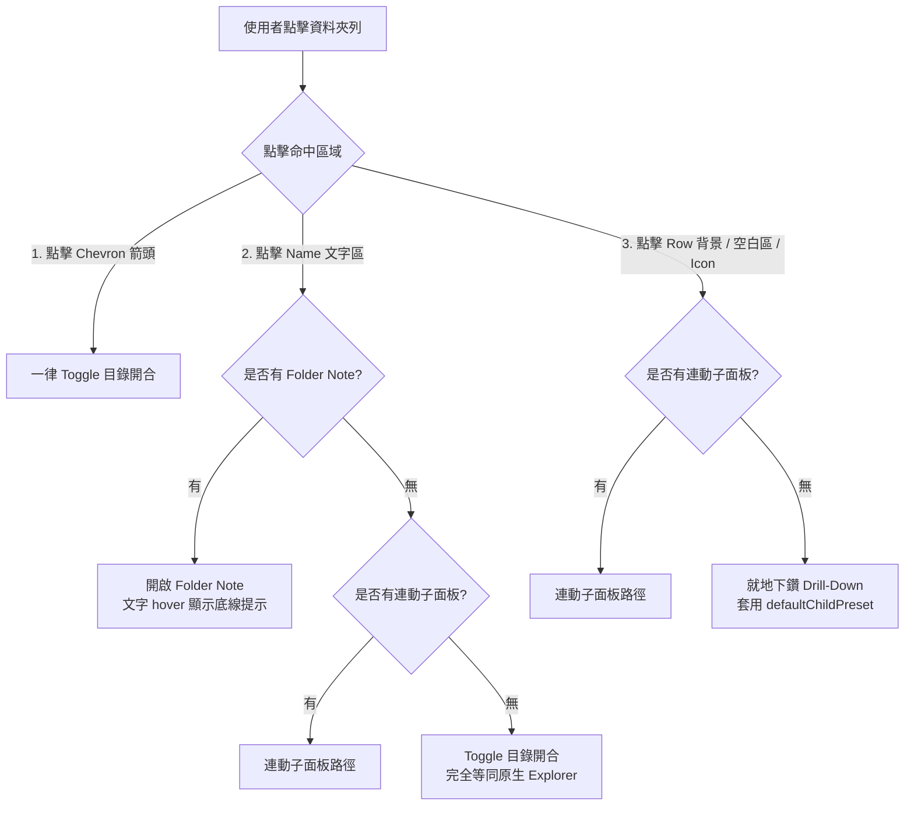
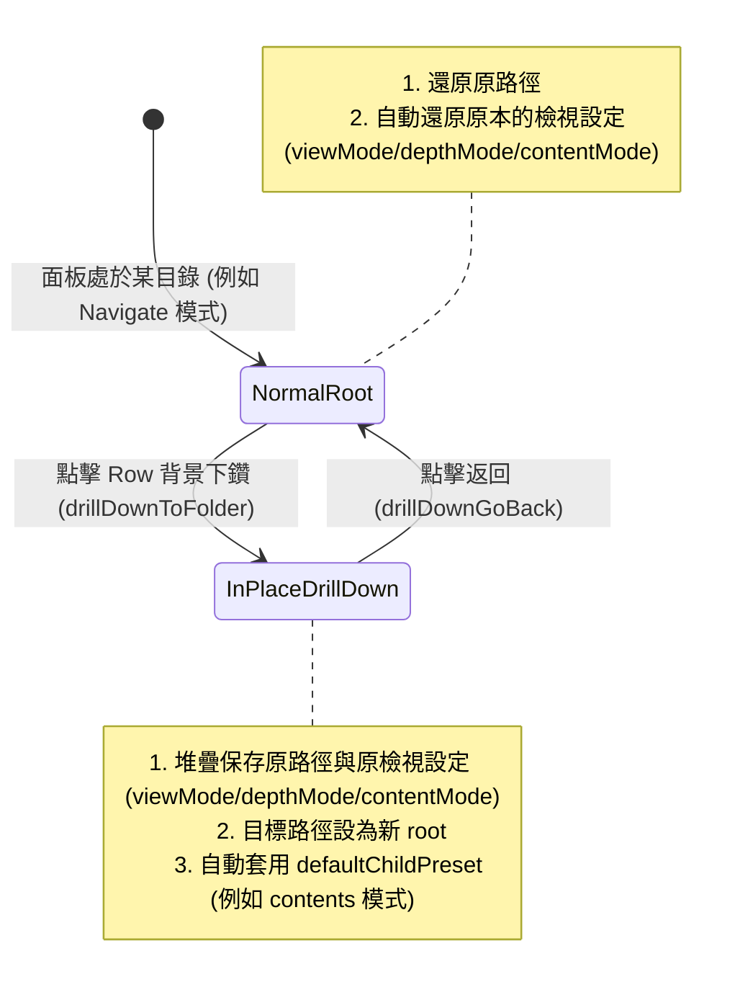
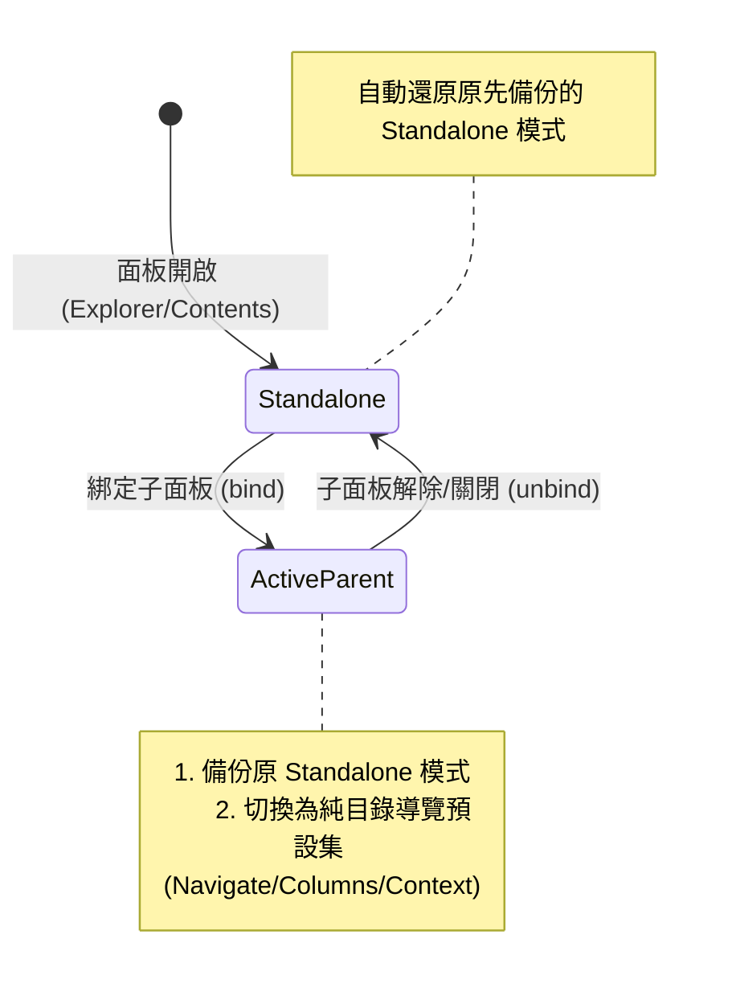

# 多面板接龍連動與檢視預設集架構設計規範 (Cascade Panel & View Presets Architecture)

> **版本**：v2.3 (2026-09-02)  
> **狀態**：點擊三段分流（Chevron / Name / Row 背景）與下鑽子面板預設集架構定稿。  
> **關聯模組**：`src/panel-binding.ts`, `src/presets.ts`, `src/folder-space-explorer.ts`, `src/folder-note-compat.ts`, `src/settings.ts`, `src/ui/settings-tab.ts`, `src/main.ts`。

---

## 1. 系統架構與設計哲學 (Architecture & Philosophy)

### 1.1 核心理念：重用原生 Explorer 內核

Folder Spaces 的核心資產是**重用 Obsidian 原生 File Explorer 的 Rich Tree 內核**。這意味著：

- 拖曳（Drag & Drop）、快捷鍵導航、右鍵選單（Context Menu）、原生搜尋篩選、以及 DOM 裝飾擴充（如相容其他外掛）均完整保留，無需從零重造。
- 透過 View 猴子補丁（Monkey Patch）與葉面封裝（Navigable Leaf），將資料夾樹限制在指定的 `folderPath` 範圍內。

### 1.2 無限深度接龍連動（Multi-Level Cascade）

多個 Folder Space 面板可以透過「父子連動（Parent-Child Binding）」串接成一條任意長度的級聯鏈條（`Parent → Child → Grandchild → ...`），並具備完整的循環依賴防護與生命週期同步（`reconcile()`）。

在接龍連動鏈中，各面板承擔不同的職責：


- **Navigator（父側導覽）**：專注於挑選目錄向下傳遞，避免檔案雜訊干擾。
- **Bridge（中繼脈絡）**：展示局部的 2 層目錄樹，可同時作為下級的導覽器。
- **Terminal（終端消費）**：展示完整的檔案與內容列表供使用者操作與閱讀。

---

## 2. 智慧點擊三段分流與社群慣例整合 (Smart 3-Zone Click Dispatch & Community UX)

### 2.1 點擊行為的統一架構：三段分流矩陣 (Chevron / Name / Row Background)

為完美兼顧「單面板 100% 貼合 Obsidian 原生 File Explorer」與「雙面板 100% 貼合 Notebook Navigator」，系統將資料夾列的點擊熱區劃分為三個獨立目標：



#### 完整分流對照矩陣

| 點擊命中區域 (Click Target) | 單面板模式（無連動子面板 / Follow OFF） | 雙面板模式（父面板有連動子面板） | 設計意圖與社群對齊 |
| :--- | :--- | :--- | :--- |
| **① Chevron 箭頭**<br>(`.nav-folder-collapse-indicator`) | **一律開合**（手動或原生 toggle） | **一律開合**（開合父樹結構） | 明確且唯一的純結構開合控制 |
| **② Name 文字區**<br>(`.nav-folder-title-content`) | • **有 Note**：開啟 Folder Note（hover 底線）<br>• **無 Note**：**就地開合**（完全等同原生） | • **有 Note**：開啟 Folder Note（hover 底線）<br>• **無 Note**：**連動子面板**（下傳路徑） | 符合 Notebook Navigator 與 Folder Notes 之文字點擊慣例 |
| **③ Row 背景／空白處／Icon**<br>(`.nav-folder-title` 扣除 Chevron/Name) | **立即就地下鑽 (In-place Drill-down)**<br>（0ms 即點即進，套用 `defaultChildPreset`） | **連動子面板**（下傳路徑至子面板） | 單面板隨時可下鑽，雙面板點列流暢驅動右側 |
| **④ 長按 450ms / Alt + 點擊**<br>(Power User 輔助通道) | 輔助觸控或長按手勢（觸發就地下鑽） | **在父面板本體強行就地下鑽** | 雙面板時欲於父側直接聚焦之逃生捷徑 |
| **⑤ 帶 Modifier 點擊 (Ctrl/Cmd)** | 執行原生點擊行為，不下鑽亦不驅動連動 | 執行原生點擊行為，不驅動連動 | 保留進階使用者原生操作 |

### 2.2 Folder Note 底線整合（取消獨立右側圖示）

取消原先在資料夾右側渲染獨立 note 小圖示（`.folder-spaces-note-icon`）的設計，全面改回社群外掛（如 Notebook Navigator、Folder Notes）慣用的**名稱文字底線提示**：

1. **視覺提示（Visual Affordance）**：
   - 當資料夾**具備** Folder Note 時，資料夾標題文字（`.nav-folder-title-content`）在滑鼠懸停時自動套用底線與指針游標：
     ```css
     .is-folder-space .nav-folder-title-content.has-folder-note:hover,
     .is-folder-space .nav-folder-title[data-has-folder-note="true"] .nav-folder-title-content:hover {
       text-decoration: underline;
       cursor: pointer;
     }
     ```
   - 當資料夾**無** Folder Note 時，文字 hover 維持原生樣式，不顯示底線。
2. **點擊語意**：
   - 點擊具有底線提示的名稱文字，直接於活躍編輯區開啟該 Folder Note，且**不觸發**目錄開合、**不觸發**子面板連動、**不觸發**就地下鑽。

### 2.3 事件監聽與命中判定 (Event Hit-Testing Architecture)

1. **事件監聽層級**：
   - 在 `.nav-file-title` / `.nav-folder-title` 上註冊點擊處理（Window Capture / Container 階段）。
2. **命中目標判定順序**：
   - `event.target.closest(".nav-folder-collapse-indicator")` $\to$ 命中 Chevron，執行開合。
   - `event.target.closest(".nav-folder-title-content")` $\to$ 命中 Name 文字：
     - 若 `hasFolderNote(folder)` $\to$ 開啟 Folder Note，並阻止事件冒泡與原生開合。
     - 若無 Folder Note $\to$ 依是否有連動子面板決定「連動下傳」或「就地開合」。
   - 其餘區域（點擊於 padding、空白背景、Folder Icon） $\to$ 依是否有連動子面板決定「連動下傳」或「立即就地下鑽」。

### 2.4 雙向視覺連結與 Hover 背景高亮 (Linked Views Hover Highlight)

比照 Obsidian 原生「Open linked view」的分頁關聯視覺回饋機制：

1. **觸發熱區 (Hover Targets)**：
   - **子面板**：頂部路徑列最左側的狀態圖示（`view.followParentButtonEl`，呈現 `lucide-link` / `lucide-unlink`）。
   - **父面板**：樹狀列表中已選中/連動中資料夾名稱後方的連結圖示（`.folder-spaces-sync-source-icon`，呈現 `link-2`）。
2. **高亮呈現 (Visual Presentation)**：
   - 滑鼠懸停於上述任一連結圖示時，調用原生 `leaf.highlight()` / `leaf.unhighlight()`，在雙方視圖 `.workspace-leaf` 上加上 `.is-highlighted`。
   - 使用與 Obsidian 官方原生 100% 精準對齊的 25% Accent 色遮罩（`color-mix(in oklch, var(--interactive-accent) 25%, transparent)`）。
   - 滑鼠移出時平滑復原，清晰向使用者指引多面板 Cascade 中的當前關聯對象。

### 2.5 跨視窗 Active File 隔離與 Auto-Reveal 邊界防護

在多視窗（Main Window + Popout Windows）環境下，Obsidian 原生 `file-open` 事件為全域廣播，容易造成「在視窗 B 開啟檔案時，視窗 A 的檔案總管被動捲動與展開」的問題。

1. **Per-Window Active File 追蹤 (`WindowActiveFileTracker`)**：
   - 監聽 `active-leaf-change` 與 `file-open` 事件，以 `WeakMap<Window, TFile>` 精準維護每個獨立視窗當前焦點編輯中的檔案 reference。
   - 手動點擊「Reveal current file」工具列按鈕時，優先查詢同視窗內的 active file。
2. **視窗邊界過濾 (Window Boundary Isolation)**：
   - 封裝 Folder Space 與原生 File Explorer 實例的 `view.onFileOpen` 進入點。
   - 當廣播來源視窗（Source Window）與當前 View 所在視窗（Target Window）不一致時，直接忽略事件，杜絕跨視窗干擾。
3. **外掛生命週期無害還原 (Clean Teardown)**：
   - 當外掛在執行階段被使用者停用（Disable）時，於 `onunload()` 立即調用 `tracker.restoreAll()`，將所有被 patch 的實例方法無縫還原為原始實作，零殘留、零副作用。

---

## 3. 檢視預設集體系與下鑽生命週期 (View Presets & Drill-Down Lifecycle)

將 `(viewMode, depthMode, contentMode)` 三個維度封裝為 7 種對稱、語意精準的預設集：

| 分類 | Preset ID | 檢視模式 (View) | 展開層級 (Depth) | 顯示內容 (Content) | 適用角色與語意 |
| :--- | :--- | :--- | :--- | :--- | :--- |
| **全功能總管** | `explorer` | `tree` | `all-level` | `all` | **標準檔案總管**（獨立面板最常用預設：全層級目錄 + 檔案） |
| **資料夾導覽** | `navigate` | `tree` | `all-level` | `folders` | **完整目錄樹**（純目錄導覽，Cascade 父側 Navigator） |
| | `columns` | `tree` | `one-level` | `folders` | **Finder 欄位導覽**（單層子目錄，極簡父側導航） |
| | `context` | `tree` | `two-level` | `folders` | **脈絡導覽**（雙層子目錄，Cascade 中繼 Bridge 面板） |
| **扁平總覽** | `contents` | `flat` | `all-level` | `all` | **內容總覽**（扁平群組化呈現所有目錄與檔案） |
| | `files` | `flat` | `all-level` | `files` | **純檔案清單**（遞迴列出所有檔案，無目錄節點） |
| | `list` | `flat` | `one-level` | `files` | **單層檔案清單**（直屬檔案清單，Cascade 終端單層檔案檢視） |

### 3.1 規則與一致性保證

- **檢視組合屬於面板（Panel-Owned View State）**：
  - `(viewMode, depthMode, contentMode)` 完全由各面板獨立持有並持久化於 Obsidian 工作區佈局（Workspace Layout）中，不隨資料夾全域綁定。
- **Depth 限制在 Tree 與 Flat 模式下皆完整生效**：
  - **Tree 模式**：Depth 控制目錄樹層級展開上限（超出深度之子項目予以隱藏並收合）。
  - **Flat 模式**：Depth 控制遞迴收集資料夾群組的深度。
- **ContentMode `files` 自動強制為 Flat**：由 `presetToState()` 保證一致性。
- **比對與識別**：由 `matchPreset()` 精確比對當前面板的三個維度。

### 3.2 就地下鑽等同子面板（Drill-Down Child Preset Lifecycle）

就地下鑽在體驗上等同於「將當前面板暫時轉換為連動子面板」：



- **下鑽進去時（`drillDownToFolder`）**：
  - 壓入堆疊：`drillDownStack.push({ folderPath, viewMode, depthMode, contentMode })`。
  - 更新路徑：`view.folderPath = targetFolderPath`。
  - **套用子面板預設集**：讀取 `settings.defaultChildPreset`（預設為 `contents`），呼叫 `applyPresetModes(view, childPreset)`。
  - **效果**：原本純目錄導覽的面板立即轉化為檔案內容面板，直屬與遞迴檔案立即可見。
- **返回上一層時（`drillDownGoBack`）**：
  - 彈出堆疊：取得前一層的 `{ folderPath, viewMode, depthMode, contentMode }`。
  - **還原原始檢視設定**：精準復原該層先前的檢視模式、深度與內容類型。
  - **效果**：無縫還原回純目錄導覽狀態。

---

## 4. 接龍自適應父面板模式 (Adaptive Cascade Parent)

### 4.1 動態角色自適應機制

當面板「有子面板連動（成為 Parent / Navigator）」與「單獨存在（Standalone）」時，使用者所需的檢視重點截然不同：



- **綁定時（`bind(parent, child)`）**：
若開啟 `adaptiveCascadeParent: true`，父面板在第一次獲得子面板時，自動將當前檢視模式記錄於 `view.savedStandalonePresetModes`，並切換至設定的純目錄導覽預設集（`cascadeParentPreset`，可選 `navigate` / `columns` / `context`，預設為 `navigate`）。
- **解除綁定/關閉時（`unbind` / 關閉分頁）**：
當父面板不再擁有任何子面板（`!bindingManager.hasChild(parent)`）時，自動將面板狀態無縫還原至原本備份的模式。

---

## 5. 設定選項頁設計 (Settings Tab & UI Architecture)

選項頁採用 Obsidian 1.12.7+ 原生 `SettingGroup` 體系，依高內聚職責重組為 4 個標準群組與規格對照表：

1. **一般設定（General）**：
  - 顯示功能區圖示（`showRibbonIcon` Toggle）
  - 總是開啟於其他面板（`alwaysOpenInOtherPanel` Toggle）
2. **預設開啟位置（Default open location）**：
  - 主視窗預設開啟位置（`defaultOpenLocationMain` Dropdown）
  - 彈出視窗預設開啟位置（`defaultOpenLocationPopout` Dropdown）
3. **檢視預設集（View Presets）**：
  - 獨立面板預設集（`defaultPreset` Dropdown，預設 `explorer`）
4. **雙面板接龍與連動（Cascade & Linking）**：
  - 預設子面板檢視預設集（`defaultChildPreset` Dropdown，預設 `contents`；子面板一律套用子面板預設集）
  - 接龍自適應父面板模式（`adaptiveCascadeParent` Toggle）
  - 父面板導覽預設集（`cascadeParentPreset` Dropdown，限定為純目錄導覽預設集 `navigate` / `columns` / `context`，預設 `navigate`）
  - 同視窗連動開關（`defaultFollowParentSameWindow` Toggle）
  - 新視窗連動開關（`defaultFollowParentNewWindow` Toggle）
5. **預設集規格對照表（Presets Reference Table）**：
  - 設定頁最底部展示 7 大預設集之維度參數（檢視風格 Tree/Flat、展開深度 1/2/All、內容項目 Folders/Files/All）與角色語意。

---

## 6. 接龍導航與鍵盤連動擴充 (Advanced Interactions & Navigation)

### 6.1 鍵盤導航下傳（Keyboard Navigation Cascade）

- **即時連動**：當使用者於父面板（Folder Space 或原生 File Explorer）透過方向鍵（↑ / ↓）或快捷鍵移動樹狀焦點至 `TFolder` 時，若存在連動子面板，自動以 30ms 防抖（Debounce）下傳焦點路徑至子面板。
- **防止頻繁重繪**：透過 30ms trailing debounce 確保快速連續按鍵時子面板不會反覆觸發不必要的完整渲染。

### 6.2 全模式大一統端點定義與視覺標記 (Universal Terminal Indicators)

本設計將「端點識別」與「視覺標記」提升為貫穿所有檢視模式（Explorer、Navigate、Columns、Context 等）的核心大一統互動架構；**點擊行為分流已統一由 §2.1 智慧分流矩陣定義**，本節僅規範端點判定與視覺呈現。

- **通用端點定義（Universal Terminal Node）**：
  - 判定公式：$\text{端點 (Terminal)} = (\text{深度已達當前限制上限}) \lor (\text{在當前檢視過濾下無任何可展示子項目})$。
  - **標準總管模式（`contentMode: "all"`）**：內部有子目錄或檔案時為非端點（▶ 箭頭）；**完全空的資料夾（0 檔案 0 目錄）** 則判定為端點（▫ 小方塊）。
  - **受限深度模式（`depthMode: "one-level"` / `"two-level"`）**：處於最深可見層級的資料夾一律判定為端點（▫ 小方塊）。
  - **純目錄導覽模式（`contentMode: "folders"`）**：內部無子目錄者（即使有檔案）一律判定為端點（▫ 小方塊）。
- **視覺工藝與標記（Visual Indicator）**：
  - 非端點節點：維持原生展開箭頭（`lucide-chevron-right`，展開時向下旋轉）。
  - 端點節點：自動掛載 `.is-terminal-folder`，將箭頭隱藏並渲染細緻圓角方塊（`5x5px`, `var(--text-faint)`），懸停時柔和微幅放大至 `1.15x` 並切換為 `var(--text-muted)`。
- **逃生通道（Predictable Control）**：
  - 點擊最左側圖示（▶ / ▫）一律嘗試原生樹狀開合，不下鑽亦不驅動子面板，提供明確掌控權；點擊名稱文字／整列才執行 §2.1 智慧分流。

### 6.3 設定生命週期管理與孤兒資料清理 (Settings Lifecycle & Orphan Cleanup)

- **即時 Vault 事件聯動**：
  - `vault.on("rename")`：當資料夾更名或搬移時，自動遷移個別資料夾字典（`folderIcons`, `folderSortOrders`）中的路徑 key（含其子路徑），並同步更新目前已開啟之 Folder Space 面板路徑。
  - `vault.on("delete")`：當資料夾被刪除時，自動刪除字典中該路徑及其子路徑之所有設定 key。
- **設定選項頁載入時清理 (On-demand Orphan Pruning)**：
  - `onload` 不進行全量檢查以確保最快載入速度；在使用者開啟外掛設定選項頁（`FolderSpacesSettingTab.display()`）時，自動比對 Vault 現存實體資料夾清單，非同步掃除因離線同步或外掛停用期間產生的孤兒設定。

---

## 7. 可進一步開發的擴充藍圖與架構邊界 (Future Enhancements & Architecture Boundaries)

### 7.1 保留評估的演進項目 (Backlog)

- 【評估中】**Folder-Scoped Pin（資料夾專屬釘選）**：
  - 在面板 Header 提供輕量化的常用筆記釘選卡片，方便在特定專案資料夾內快速存取關鍵入口檔案。
- 【評估中】**雙面板快捷鍵批次操作（Twin-Pane Keyboard Operations）**：
  - 基礎的**跨面板滑鼠拖曳（Drag & Drop）已完整支援**（沿用 Obsidian 原生拖曳能力）；此處僅指為 Power User 提供跨面板的鍵盤快捷鍵批次複製/搬移。
- 【新版評估】**卡片式網格導覽器 (Card Grid Navigator)**：
  - 設計成可設定 Max Rows / Max Columns 或依 parent content area 自動配適行列數目的網格/卡片式導航，作為獨立視圖元件。

---

## 8. 驗收標準與品質門禁 (Quality Gates & Verification)

1. **自動化測試覆蓋**：
  - 包含 `tests/presets.test.ts`、`tests/settings.test.ts`、`tests/tree-navigation.test.ts`、`tests/panel-binding.test.ts`、`tests/folder-note-compat.test.ts` 等 115 項單元測試，達成 100% 通過。
2. **語法與專案健全度**：
  - `npm run check:project` 通過（含 shared engine 與 ObsidianWindowSpaces byte-identical 驗證）。
  - `npm run lint` 達成 0 Error, 0 Warning。
  - `npm run build` 與 `npm run test:build` 通過，產物已部署至測試庫並驗證雜湊一致。
3. **實機與行為驗證（Interactive & Runtime Verification）**：
  - 驗證 Setting Tab 的 Presets Reference Table 樣式與 4 大高內聚設定群組。
  - 驗證 Toolbar 最左側下拉選單「開啟 Folder Spaces 設定」能正常喚起外掛設定頁。
  - 驗證鍵盤方向鍵上下移動焦點時，子面板順暢即時跟隨。
  - **驗證三段點擊分流**：
    - 點擊 Chevron 箭頭一律開合目錄樹。
    - 點擊 Name 文字區：有 Folder Note 時開啟筆記（hover 底線提示）；無 Folder Note 且有子面板時連動子面板；無 Folder Note 且無子面板時開合目錄樹。
    - 點擊 Row 背景空白處：有子面板時連動子面板；無子面板時立即就地下鑽。
  - **驗證就地下鑽套用子面板預設集**：
    - 下鑽時自動切換為 `defaultChildPreset`（預設為 `contents`，即時呈現檔案清單）。
    - 點擊返回按鈕時自動還原原本的檢視模式（如 `navigate`）。
  - 驗證資料夾更名與刪除時設定自動同步遷移與修剪，設定頁開啟時自動掃除孤兒設定。

